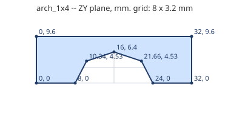
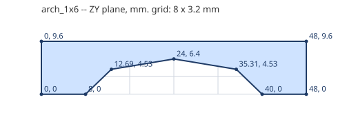

# Arches

Pillars at each end, a beam over an opening.

Generated by `tools/part_sheets.gd`. All sizes in **mm at print scale** (= Blender units,
see [README](README.md)); game metres are x43.75. Origin is the part's min corner:
X across the width W, Z along the length L, Y up. **Grid** is the envelope the game
uses; **real** is the outline to model, 0.1 mm in from the grid on every side.

| Part | Studs W x L | Plates | Grid W x L x H | Real W x L x H | Game m | Studs | Mass g |
|---|---|---|---|---|---|---|---|
| `arch_1x4` | 1 x 4 | 3 | 8 x 32 x 9.6 | 7.8 x 31.8 x 9.6 | 0.35 x 1.4 x 0.42 | 4 | 0.8 |
| `arch_1x6` | 1 x 6 | 3 | 8 x 48 x 9.6 | 7.8 x 47.8 x 9.6 | 0.35 x 2.1 x 0.42 | 6 | 1.2 |

## `arch_1x4`

- **Grid** 8 x 32 x 9.6 mm; **real** 7.8 x 31.8 x 9.6 mm; studs add 1.7 mm on top.
- **Studs on top** (4, Ø4.8 x 1.7 mm, centres x, z): (4, 4), (4, 12), (4, 20), (4, 28)
- **Underside tubes** (Ø6.51 outer / Ø4.8 inner, centres x, z): none
- **Profile** in the ZY plane (first number Z, second Y), extruded along X from 0 to 8 mm:
  (0, 0), (8, 0), (10.34, 4.53), (16, 6.4), (21.66, 4.53), (24, 0), (32, 0), (32, 9.6), (0, 9.6)

  

- **Orientations:** arch_1x4_x, arch_1x4_x_i, arch_1x4_z, arch_1x4_z_i

## `arch_1x6`

- **Grid** 8 x 48 x 9.6 mm; **real** 7.8 x 47.8 x 9.6 mm; studs add 1.7 mm on top.
- **Studs on top** (6, Ø4.8 x 1.7 mm, centres x, z): (4, 4), (4, 12), (4, 20), (4, 28), (4, 36), (4, 44)
- **Underside tubes** (Ø6.51 outer / Ø4.8 inner, centres x, z): none
- **Profile** in the ZY plane (first number Z, second Y), extruded along X from 0 to 8 mm:
  (0, 0), (8, 0), (12.69, 4.53), (24, 6.4), (35.31, 4.53), (40, 0), (48, 0), (48, 9.6), (0, 9.6)

  

- **Orientations:** arch_1x6_x, arch_1x6_x_i, arch_1x6_z, arch_1x6_z_i

