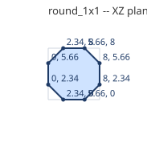
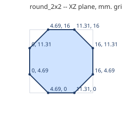

# Round bricks

An octagonal brick, flats on the footprint edges.

Generated by `tools/part_sheets.gd`. All sizes in **mm at print scale** (= Blender units,
see [README](README.md)); game metres are x43.75. Origin is the part's min corner:
X across the width W, Z along the length L, Y up. **Grid** is the envelope the game
uses; **real** is the outline to model, 0.1 mm in from the grid on every side.

| Part | Studs W x L | Plates | Grid W x L x H | Real W x L x H | Game m | Studs | Mass g |
|---|---|---|---|---|---|---|---|
| `round_1x1` | 1 x 1 | 3 | 8 x 8 x 9.6 | 7.8 x 7.8 x 9.6 | 0.35 x 0.35 x 0.42 | 1 | 0.3 |
| `round_2x2` | 2 x 2 | 3 | 16 x 16 x 9.6 | 15.8 x 15.8 x 9.6 | 0.7 x 0.7 x 0.42 | 4 | 1.2 |

## `round_1x1`

- **Grid** 8 x 8 x 9.6 mm; **real** 7.8 x 7.8 x 9.6 mm; studs add 1.7 mm on top.
- **Studs on top** (1, Ø4.8 x 1.7 mm, centres x, z): (4, 4)
- **Underside tubes** (Ø6.51 outer / Ø4.8 inner, centres x, z): none
- **Profile** in the XZ plane (first number X, second Z), extruded along Y from 0 to 9.6 mm:
  (8, 5.66), (5.66, 8), (2.34, 8), (0, 5.66), (0, 2.34), (2.34, 0), (5.66, 0), (8, 2.34)

  

- **Orientations:** round_1x1, round_1x1_i

## `round_2x2`

- **Grid** 16 x 16 x 9.6 mm; **real** 15.8 x 15.8 x 9.6 mm; studs add 1.7 mm on top.
- **Studs on top** (4, Ø4.8 x 1.7 mm, centres x, z): (4, 4), (12, 4), (4, 12), (12, 12)
- **Underside tubes** (Ø6.51 outer / Ø4.8 inner, centres x, z): (8, 8)
- **Profile** in the XZ plane (first number X, second Z), extruded along Y from 0 to 9.6 mm:
  (16, 11.31), (11.31, 16), (4.69, 16), (0, 11.31), (0, 4.69), (4.69, 0), (11.31, 0), (16, 4.69)

  

- **Orientations:** round_2x2, round_2x2_i

