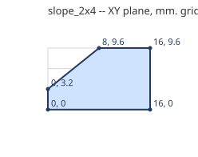

# Slopes

A brick whose top falls to the front; studs only on the flat back strip.

Generated by `tools/part_sheets.gd`. All sizes in **mm at print scale** (= Blender units,
see [README](README.md)); game metres are x43.75. Origin is the part's min corner:
X across the width W, Z along the length L, Y up. **Grid** is the envelope the game
uses; **real** is the outline to model, 0.1 mm in from the grid on every side.

| Part | Studs W x L | Plates | Grid W x L x H | Real W x L x H | Game m | Studs | Mass g |
|---|---|---|---|---|---|---|---|
| `slope_1x2` | 1 x 2 | 3 | 8 x 16 x 9.6 | 7.8 x 15.8 x 9.6 | 0.35 x 0.7 x 0.42 | 1 | 0.5 |
| `slope_2x2` | 2 x 2 | 3 | 16 x 16 x 9.6 | 15.8 x 15.8 x 9.6 | 0.7 x 0.7 x 0.42 | 2 | 1 |
| `slope_2x4` | 2 x 4 | 3 | 16 x 32 x 9.6 | 15.8 x 31.8 x 9.6 | 0.7 x 1.4 x 0.42 | 4 | 2 |

## `slope_1x2`

- **Grid** 8 x 16 x 9.6 mm; **real** 7.8 x 15.8 x 9.6 mm; studs add 1.7 mm on top.
- **Studs on top** (1, Ø4.8 x 1.7 mm, centres x, z): (4, 12)
- **Underside tubes** (Ø6.51 outer / Ø4.8 inner, centres x, z): none
- **Underside anti-stud pins** (one-wide part, between sockets; centres x, z): (4, 8)
- **Profile** in the ZY plane (first number Z, second Y), extruded along X from 0 to 8 mm:
  (0, 0), (16, 0), (16, 9.6), (8, 9.6), (0, 3.2)

  

- **Orientations:** slope_1x2_y0, slope_1x2_y0_i, slope_1x2_y1, slope_1x2_y1_i, slope_1x2_y2, slope_1x2_y2_i, slope_1x2_y3, slope_1x2_y3_i

## `slope_2x2`

- **Grid** 16 x 16 x 9.6 mm; **real** 15.8 x 15.8 x 9.6 mm; studs add 1.7 mm on top.
- **Studs on top** (2, Ø4.8 x 1.7 mm, centres x, z): (4, 12), (12, 12)
- **Underside tubes** (Ø6.51 outer / Ø4.8 inner, centres x, z): (8, 8)
- **Profile** in the ZY plane (first number Z, second Y), extruded along X from 0 to 16 mm:
  (0, 0), (16, 0), (16, 9.6), (8, 9.6), (0, 3.2)

  

- **Orientations:** slope_2x2_y0, slope_2x2_y0_i, slope_2x2_y1, slope_2x2_y1_i, slope_2x2_y2, slope_2x2_y2_i, slope_2x2_y3, slope_2x2_y3_i

## `slope_2x4`

- **Grid** 16 x 32 x 9.6 mm; **real** 15.8 x 31.8 x 9.6 mm; studs add 1.7 mm on top.
- **Studs on top** (4, Ø4.8 x 1.7 mm, centres x, z): (12, 4), (12, 12), (12, 20), (12, 28)
- **Underside tubes** (Ø6.51 outer / Ø4.8 inner, centres x, z): (8, 8), (8, 16), (8, 24)
- **Profile** in the XY plane (first number X, second Y), extruded along Z from 0 to 32 mm:
  (0, 0), (16, 0), (16, 9.6), (8, 9.6), (0, 3.2)

  

- **Orientations:** slope_2x4_y0, slope_2x4_y0_i, slope_2x4_y1, slope_2x4_y1_i, slope_2x4_y2, slope_2x4_y2_i, slope_2x4_y3, slope_2x4_y3_i

