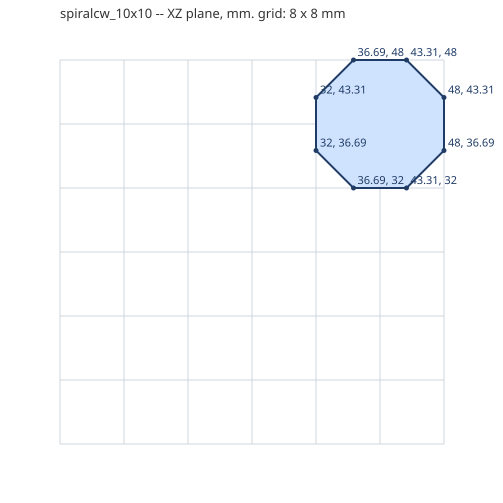
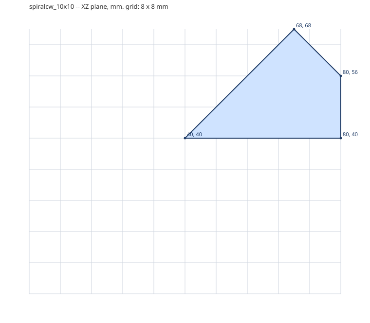
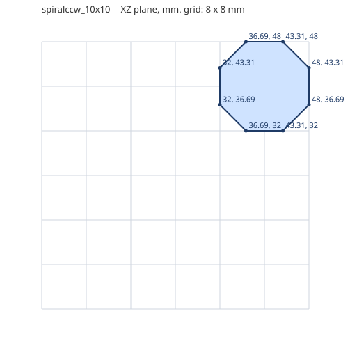
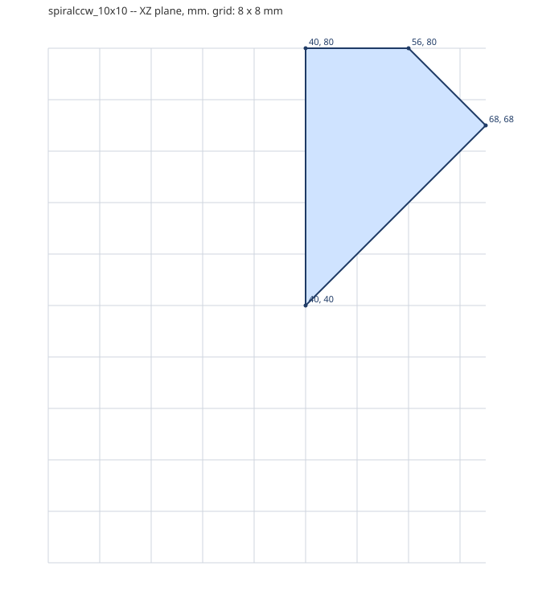

# Spiral stairs

A quarter turn of stair: a round-2x2 newel and two 45-degree steps. Clockwise (cw) or anticlockwise (ccw) seen from above.

Generated by `tools/part_sheets.gd`. All sizes in **mm at print scale** (= Blender units,
see [README](README.md)); game metres are x43.75. Origin is the part's min corner:
X across the width W, Z along the length L, Y up. **Grid** is the envelope the game
uses; **real** is the outline to model, 0.1 mm in from the grid on every side.

| Part | Studs W x L | Plates | Grid W x L x H | Real W x L x H | Game m | Studs | Mass g |
|---|---|---|---|---|---|---|---|
| `spiralcw_10x10` | 10 x 10 | 4 | 80 x 80 x 12.8 | 79.8 x 79.8 x 12.8 | 3.5 x 3.5 x 0.56 | 20 | 5.8 |
| `spiralccw_10x10` | 10 x 10 | 4 | 80 x 80 x 12.8 | 79.8 x 79.8 x 12.8 | 3.5 x 3.5 x 0.56 | 20 | 5.8 |

## `spiralcw_10x10`

- **Grid** 80 x 80 x 12.8 mm; **real** 79.8 x 79.8 x 12.8 mm; studs add 1.7 mm on top.
- **Studs on top** (20, Ø4.8 x 1.7 mm, centres x, z): (36, 36), (44, 36), (36, 44), (44, 44), (52, 44), (60, 44), (68, 44), (76, 44), (44, 52), (60, 52), (68, 52), (76, 52), (44, 60), (52, 60), (68, 60), (44, 68), (52, 68), (60, 68), (44, 76), (52, 76)
- **Underside tubes** (Ø6.51 outer / Ø4.8 inner, centres x, z): (40, 40), (56, 48), (64, 48), (72, 48), (64, 56)
- **Profile** in the XZ plane (first number X, second Z), extruded along Y from 0 to 12.8 mm:
  (48, 43.31), (43.31, 48), (36.69, 48), (32, 43.31), (32, 36.69), (36.69, 32), (43.31, 32), (48, 36.69)

  

- **Profile** in the XZ plane (first number X, second Z), extruded along Y from 0 to 6.4 mm:
  (40, 40), (80, 40), (80, 56), (68, 68)

  

- **Profile** in the XZ plane (first number X, second Z), extruded along Y from 6.4 to 12.8 mm:
  (40, 40), (68, 68), (56, 80), (40, 80)

  

- **Orientations:** spiralcw_10x10_y0, spiralcw_10x10_y0_i, spiralcw_10x10_y1, spiralcw_10x10_y1_i, spiralcw_10x10_y2, spiralcw_10x10_y2_i, spiralcw_10x10_y3, spiralcw_10x10_y3_i

## `spiralccw_10x10`

- **Grid** 80 x 80 x 12.8 mm; **real** 79.8 x 79.8 x 12.8 mm; studs add 1.7 mm on top.
- **Studs on top** (20, Ø4.8 x 1.7 mm, centres x, z): (36, 36), (44, 36), (36, 44), (44, 44), (52, 44), (60, 44), (68, 44), (76, 44), (44, 52), (60, 52), (68, 52), (76, 52), (44, 60), (52, 60), (68, 60), (44, 68), (52, 68), (60, 68), (44, 76), (52, 76)
- **Underside tubes** (Ø6.51 outer / Ø4.8 inner, centres x, z): (40, 40), (48, 56), (48, 64), (56, 64), (48, 72)
- **Profile** in the XZ plane (first number X, second Z), extruded along Y from 0 to 12.8 mm:
  (48, 43.31), (43.31, 48), (36.69, 48), (32, 43.31), (32, 36.69), (36.69, 32), (43.31, 32), (48, 36.69)

  

- **Profile** in the XZ plane (first number X, second Z), extruded along Y from 0 to 6.4 mm:
  (40, 40), (40, 80), (56, 80), (68, 68)

  

- **Profile** in the XZ plane (first number X, second Z), extruded along Y from 6.4 to 12.8 mm:
  (40, 40), (68, 68), (80, 56), (80, 40)

  

- **Orientations:** spiralccw_10x10_y0, spiralccw_10x10_y0_i, spiralccw_10x10_y1, spiralccw_10x10_y1_i, spiralccw_10x10_y2, spiralccw_10x10_y2_i, spiralccw_10x10_y3, spiralccw_10x10_y3_i

